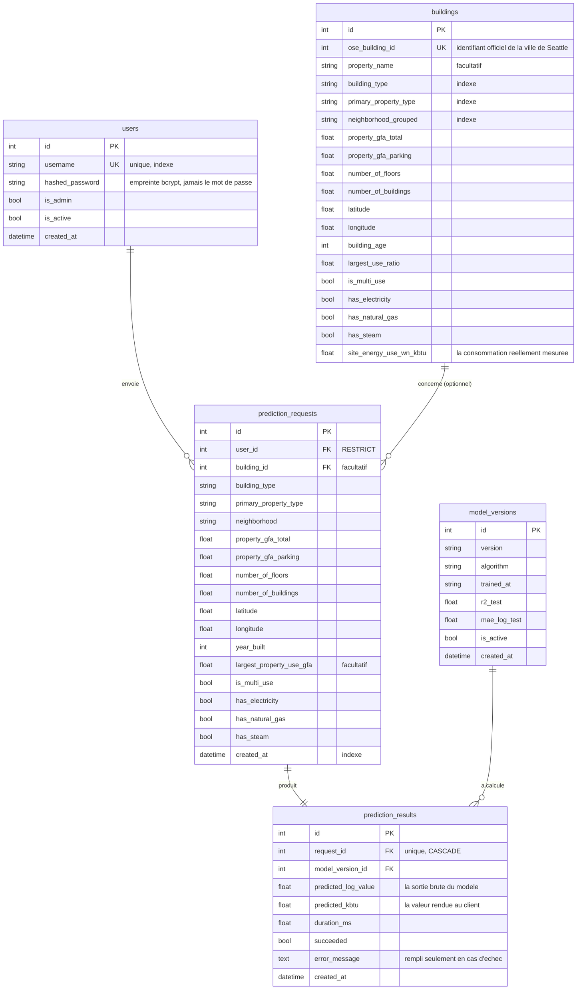

# Modele de donnees

## Le schema en un coup d'oeil

## Les choix de conception, et ce qu'ils evitent

### Pourquoi deux tables pour un seul appel

`prediction_requests` garde ce qu'on a recu, `prediction_results` ce qu'on a repondu.
Une table unique perdrait les appels qui echouent : la ligne ne serait ecrite qu'une
fois la prediction reussie. Or ce sont exactement ces appels-la qu'on cherche quand un
client se plaint.

Concretement, l'ordre d'ecriture est : demande enregistree, puis modele appele, puis
resultat enregistre. Un plantage du modele laisse donc une demande et un resultat en
echec, avec son message d'erreur.

### Pourquoi une table des versions du modele

Une prediction gardee six mois serait inexplicable sans elle : on ne saurait plus quel
modele l'a produite ni ce qu'il valait. Chaque resultat pointe vers sa version, avec
son R2 et sa date d'entrainement.

### Ce que les contraintes empechent

| Contrainte | Ce qu'elle empeche |
|---|---|
| `users.username` unique | Deux comptes homonymes, donc une connexion ambigue |
| `buildings.ose_building_id` unique | Le meme batiment de Seattle insere deux fois |
| `prediction_results.request_id` unique | Deux reponses differentes pour une meme demande |
| `prediction_requests.user_id` obligatoire | Une prediction anonyme, non tracable |
| `user_id` en RESTRICT | La suppression d'un compte effacant son historique |
| `request_id` en CASCADE | Un resultat orphelin, rattache a rien |
| `site_energy_use_wn_kbtu` obligatoire | Un batiment de reference sans sa consommation mesuree |

### Les index, et pourquoi ceux-la

Un index accelere la recherche sur une colonne, au prix d'un peu d'espace et d'une
ecriture legerement plus lente. On n'en met donc que sur ce qui sert reellement a
filtrer.

- `buildings.ose_building_id` : la cle par laquelle un batiment est demande.
- `buildings.building_type`, `primary_property_type`, `neighborhood_grouped` : les
  trois filtres exposes par `GET /buildings`.
- `prediction_requests.user_id` et `created_at` : le journal d'un compte est toujours
  lu filtre par utilisateur et trie par date.
- `users.username` : lu a chaque connexion et a chaque verification de jeton.

### Le volume

Les 1 508 batiments sont figes : ils viennent du releve 2016. Ce sont les deux tables
de predictions qui grossissent, d'une ligne chacune par appel. Sur cette base,
100 000 appels representent environ 30 Mo, ce qu'un PostgreSQL absorbe sans reglage
particulier. La pagination de `GET /buildings` et de `GET /predictions` est plafonnee
a 200 lignes pour qu'aucune requete ne puisse demander la table entiere.
